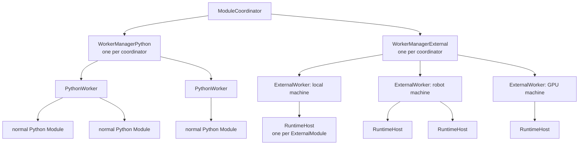
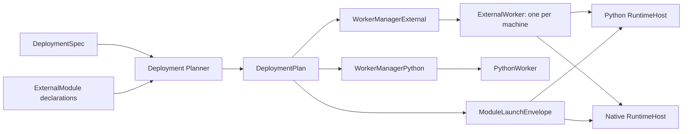
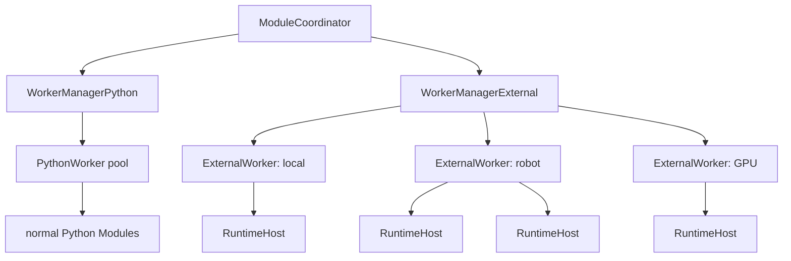

# Proposal: Module Deployment for DimOS

Status: draft for review.

This proposal defines a shared deployment model for normal Python modules, packaged Python modules, native modules, and remote execution. The key idea is simple: DimOS should keep a stable module identity while deployment decides where and how the implementation runs.

## 1. Problem / Why now

DimOS has several deployment pressures that currently look separate:

- Python modules sometimes need heavy or conflicting dependencies that should not live in the coordinator environment.
- Native modules need repeatable build and runtime preparation.
- Remote deployment needs code or artifact sync, target preparation, process launch, logs, health, and cleanup.
- Weak robot computers may need prepared artifacts, cross-compilation, or runtime closures built elsewhere.
- Native and packaged Python modules need a shared way to describe config, stream topics, transports, and lifecycle handoff.

The common problem is **module deployment**.

The current local Python path works well for in-environment Python modules. But once a module has its own runtime requirement, DimOS needs an explicit deployment layer that can prepare the requirement, launch the implementation, and keep the Blueprint-facing module identity stable.

## 2. Current state

### Normal Python modules

Normal Python modules run inside the current DimOS Python worker environment.

```text
ModuleCoordinator
  -> WorkerManagerPython
    -> PythonWorker
      -> Python Module instance
```

They get the full DimOS surface: streams, RPCs, skills, module refs, lifecycle, and Blueprint wiring. This path should remain the default for local, in-environment Python modules.

### Current NativeModule

Today, a native module is a Python `NativeModule` wrapper deployed through the Python worker. The wrapper declares the DimOS-facing streams and config, then spawns an external executable.

```text
PythonWorker
  -> NativeModule wrapper
    -> native subprocess
```

The wrapper owns Blueprint integration, lifecycle, topic assignment, config serialization, logs, and process supervision. The native subprocess owns computation and direct pub/sub.

`NativeModuleConfig` already carries a proto launch recipe:

- `cwd`
- `executable`
- `build_command`
- `extra_args`
- `extra_env`
- `stdin_config`
- `auto_build`

When `stdin_config=True`, the wrapper sends a JSON payload to the native process:

```json
{
  "topics": {"input": "/topic#Type", "output": "/topic#Type"},
  "config": {"field": "value"}
}
```

That JSON is a useful starting point for a future **Module Launch Envelope**.

### Recent packaged Python exploration

Recent work on isolated Python runtime modules, including PR #2704, proves one backend: a Python module can keep a dependency-light Module Contract while the implementation runs in a prepared Python runtime project.

It adds:

- runtime environment registration,
- class-keyed runtime placement,
- deployment-time runtime reconciliation,
- runtime-specific Python worker pools,
- launch through the prepared `.venv/bin/python`,
- a runnable example package.

The broader lesson is not the exact worker implementation. The lesson is the seam: **what DimOS sees** can be separated from **where the implementation runs**.

### Native branches point in the same direction

Recent native-module branches show the same pressure from the native side:

- Andrew's stdin-config work makes native config and topics serializable instead of CLI-only.
- Andrew's Rust transport work adds native transport backends, including Zenoh.
- Andrew's Rust TF work gives native modules more of the DimOS service surface.
- Ivan's MLS planner work uses a Python native wrapper beside a Rust package and `cargo build --release`.

These are not the same feature as packaged Python runtime work. They point at the same architecture: describe what a module is, what it needs, where it runs, and how deployment prepares it.

## 3. Proposed model

The proposal extends the existing manager/worker split instead of introducing a separate deployment stack.



The ownership boundaries follow current DimOS:

```text
ModuleCoordinator       groups modules by deployment backend
WorkerManagerPython     schedules the normal Python worker pool
PythonWorker            controls one Python worker process
WorkerManagerExternal   assigns external modules to machine workers
ExternalWorker          controls one worker process on one machine
RuntimeHost             runs one external implementation
```

### 3.1 Module contract shape

`ExternalModule` is a declarative `Module` subclass. It adds an implementation reference but no build, process, watchdog, or transport behavior.

Packaged Python uses a class import reference:

```python
class HeavyDetector(ExternalModule):
    implementation = "heavy_detector.module:HeavyDetectorImpl"

    config: HeavyDetectorConfig
    image: In[Image]
    detections: Out[Detections]
```

```python
class HeavyDetectorImpl(HeavyDetector):
    def start(self) -> None:
        ...
```

Runtime Host imports the class and requires:

```python
issubclass(HeavyDetectorImpl, HeavyDetector)
```

Native execution uses an executable path relative to its convention-discovered implementation folder:

```python
from pathlib import Path as FsPath


class MLSPlanner(ExternalModule):
    implementation = FsPath("target/release/mls_planner")

    config: MLSPlannerConfig
    global_map: In[PointCloud2]
    goal_pose: In[PoseStamped]
    path: Out[Path]
```

The implementation type is sufficient:

```text
str    Python class import reference
pathlib.Path   native executable
```

The class location anchors package discovery. `ExternalModule` should not be sent to `PythonWorker`; it requires a Deployment Spec and the external worker path.

### 3.2 Complete Deployment Spec

A Deployment Spec references a Blueprint, defines named targets, and assigns Module Contract classes to target names:

```python
go2_deployment = DeploymentSpec(
    blueprint=go2_stack,
    targets={
        "robot": SshTarget(
            host="go2",
            workspace="~/dimos-deployments/go2",
        ),
        "gpu": SshTarget(
            host="gpu-box",
            workspace="~/dimos-deployments/go2",
        ),
    },
    assignments={
        MLSPlanner: "robot",
        HeavyDetector: "gpu",
    },
)
```

The v1 rules are concrete:

- `blueprint` supplies active modules, stream wiring, module refs, and config surfaces.
- `targets` maps stable string names to execution target definitions.
- `assignments` maps Module Contract classes to target names.
- `local` always exists as an implicit target.
- modules absent from `assignments` run on `local`.
- an in-environment Python module, the most common module kind, cannot be assigned to a non-local target.
- each target name identifies one execution machine in v1; aliases for the same machine are rejected.

### 3.3 Key model shapes

The public declaration remains small:

```python
class ExternalModule(Module):
    implementation: ClassVar[str | FsPath]
```

```python
@dataclass(frozen=True)
class DeploymentSpec:
    blueprint: Blueprint
    targets: Mapping[str, ExecutionTarget]
    assignments: Mapping[type[ModuleBase], str]
```

```python
@dataclass(frozen=True)
class ResolvedExternalModule:
    contract: type[ExternalModule]
    implementation: str | FsPath
    implementation_dir: Path
    preset: ConventionPreset
```

```python
@dataclass(frozen=True)
class DeploymentPlan:
    modules: tuple[ResolvedModuleDeployment, ...]
```

```python
@dataclass(frozen=True)
class ResolvedModuleDeployment:
    contract: type[ModuleBase]
    target_name: str
    target: ExecutionTarget
    external: ResolvedExternalModule | None
    prepare_steps: tuple[PrepareStep, ...]
    worker_route: WorkerRoute
```

The distinction is operational:

```text
DeploymentSpec   user-authored placement intent
ExternalModule   module-owned implementation declaration
DeploymentPlan   validated and fully resolved actions
```

### 3.4 Planning, prepare, and deploy

Deployment planning resolves every active Blueprint module:

```text
for each active module in the Blueprint:
    target = assignments.get(module, "local")

    if issubclass(module, ExternalModule):
        implementation_dir = discover python/, rust/, or cpp/ beside the module
        preset = resolve exactly one Convention Preset
        prepare_steps = preset.prepare(module, implementation_dir, target)
        route = WorkerManagerExternal -> ExternalWorker(target) -> RuntimeHost
    else:
        require target == "local"
        route = WorkerManagerPython -> PythonWorker

    emit ResolvedModuleDeployment
```

`WorkerManagerExternal` owns orchestration for the external backend:

```text
group modules by target
create or reuse one ExternalWorker handle per machine
coordinate prepare in parallel
deploy RuntimeHosts
roll back successful work if another deployment fails
aggregate worker health and shutdown
```

Each coordinator-side `ExternalWorker` sends requests over one control connection to its target-side external worker entrypoint. That entrypoint executes target-local actions:

```text
run prepare steps on its machine
spawn one RuntimeHost per ExternalModule
forward control requests by module ID
collect logs, readiness, health, and exit state
stop RuntimeHosts during rollback or shutdown
```

`DeploymentPlan` is immutable data consumed by the manager/worker path; it is not a separate behavioral reconciler layer.

Planning fails before mutation when:

- an assignment references a target absent from `targets`,
- an assignment references a module absent from the Blueprint,
- an in-environment Python module is assigned remotely,
- an `ExternalModule` has no discoverable implementation folder,
- zero or multiple Convention Presets match,
- a required lockfile, project file, source manifest, or build declaration is missing.

A native executable is normally a prepare output, so planning validates its declared relative path but does not require the file to exist. Prepare must verify that the executable exists before launch.

### 3.5 Resolved plan

The previous Deployment Spec should resolve to an inspectable plan:

```text
Module           Target   Preset        Prepare                   Worker route
Agent            local    —             —                         WorkerManagerPython -> PythonWorker
MLSPlanner       robot    CargoNative   remote cargo build        WorkerManagerExternal -> ExternalWorker -> RuntimeHost
HeavyDetector    gpu      UvRuntime      remote uv sync --locked   WorkerManagerExternal -> ExternalWorker -> RuntimeHost
```

Plan, prepare, and run should consume the same `DeploymentPlan`; they should not independently rediscover package or assignment state.

### 3.6 Module Launch Envelope

After prepare and connection resolution, Runtime Host receives one unified envelope:

```python
@dataclass(frozen=True)
class ModuleLaunchEnvelope:
    module: str
    runtime: RuntimeLaunch
    config: ModuleConfigPayload
    topics: Mapping[str, TopicBinding]
    control: ControlEndpoint
```

```json
{
  "module": "MLSPlanner",
  "runtime": {
    "executable": "target/release/mls_planner"
  },
  "topics": {
    "global_map": {
      "channel": "/global_map",
      "type": "sensor_msgs.PointCloud2",
      "transport": "zenoh"
    }
  },
  "config": {
    "world_frame": "map",
    "voxel_size": 0.1
  },
  "control": {
    "endpoint": "..."
  }
}
```

This extends the current `NativeModule.stdin_config` shape. DimOS may track where fields originate internally, but Runtime Host receives one handoff containing launch metadata, module config, stream bindings, transport descriptors, and control details.

### 3.7 Process topology



## 4. Package discovery convention

The `ExternalModule` class file anchors package discovery. Deployment Spec only assigns that class to a target; it does not repeat or override implementation details.

The implementation directory is selected by a hardcoded sibling convention:

```text
python/pyproject.toml   packaged Python implementation
rust/Cargo.toml        Rust executable implementation
cpp/CMakeLists.txt     C++ executable implementation
```

Python may include Pixi or Nix metadata inside `python/`:

```text
python/
  pyproject.toml
  uv.lock
  pixi.toml
  pixi.lock
  src/...
```

The `implementation` field is interpreted using the discovered directory:

```text
python/ + str    import a Python implementation class
rust/   + Path   launch an executable relative to rust/
cpp/    + Path   launch an executable relative to cpp/
```

### Existing native precedent

Current native modules already follow a lightweight convention:

```text
mls_planner/
  mls_planner_native.py        # NativeModule wrapper / Module Contract
  rust/
    Cargo.toml
    Cargo.lock
    src/...
```

The wrapper declares:

```python
class MLSPlannerNativeConfig(NativeModuleConfig):
    cwd = "rust"
    executable = "target/release/mls_planner"
    build_command = "cargo build --release"
    stdin_config = True
```

Deployment should generalize this convention rather than replace it with a manifest immediately.

The new API extends the design with a parallel declarative module, leaving the existing `NativeModule` untouched until migration:

```text
mls_planner/
  mls_planner_native.py        # existing NativeModule compatibility path
  mls_planner_external.py      # new ExternalModule declaration
  rust/
    Cargo.toml
    src/...
```

```python
from pathlib import Path as FsPath


class MLSPlanner(ExternalModule):
    implementation = FsPath("target/release/mls_planner")

    global_map: In[PointCloud2]
    path: Out[Path]
```

### Packaged Python mirror

Packaged Python should mirror the native shape:

```text
detector/
  detector_module.py           # ExternalModule declaration
  python/
    pyproject.toml
    uv.lock
    src/detector_runtime/
      module.py                # Runtime implementation
```

```python
class HeavyDetector(ExternalModule):
    implementation = "detector_runtime.module:HeavyDetectorImpl"

    image: In[Image]
    detections: Out[Detections]
```

V1 discovery rule:

1. Start at the `ExternalModule` class file.
2. Walk to the nearest package root.
3. Look for exactly one of `python/pyproject.toml`, `rust/Cargo.toml`, or `cpp/CMakeLists.txt`.
4. Interpret `implementation` as a Python class reference or executable path according to the matched convention.
5. Fail during planning if zero or multiple implementation directories match.

The convention can expand later, but v1 should not expose a project-root override.

### Convention presets

Users should not need to type raw `uv sync`, `pixi install`, `cargo build`, or CMake commands for every module. DimOS should ship **Convention Presets** that recognize common layouts and expand them into default prepare, sync, and launch behavior.

Initial presets:

```text
python/pyproject.toml + python/uv.lock
  -> uv runtime preset

python/pixi.toml + python/pixi.lock + python/pyproject.toml
  -> Pixi-backed Python runtime preset

rust/Cargo.toml
  -> Cargo native preset

cpp/CMakeLists.txt
  -> CMake native preset
```

Preset matching uses the most specific convention: a Python directory with Pixi metadata selects the Pixi-backed preset; otherwise `pyproject.toml` plus `uv.lock` selects the uv preset. If no preset matches or unrelated implementation directories conflict, fail during planning. Custom project-root and preset overrides are deferred until a concrete module needs them.

## 5. Worker / runtime architecture

DimOS keeps one manager per deployment backend:



There is one `WorkerManagerPython` and one `WorkerManagerExternal` per coordinator. `WorkerManagerExternal` owns one coordinator-side `ExternalWorker` handle per execution machine. Each handle communicates with one target-side external worker entrypoint, which owns one `RuntimeHost` per deployed `ExternalModule`.

### Normal Python modules

Normal Python modules stay local and use the existing PythonWorker path.

```text
Normal Python Module -> PythonWorker
```

They are not remotely deployable in v1. If a module is assigned to a non-local target, it must be packaged Python or native.

This proposal does not replace PythonWorker. In-environment Python modules should keep using PythonWorker because its lightweight object and RPC envelope works well for normal local modules.

### Packaged Python modules

Packaged Python implementations are declared through `ExternalModule` and always use `WorkerManagerExternal`, `ExternalWorker`, and Runtime Host, even on the local machine.

```text
ExternalModule -> WorkerManagerExternal -> ExternalWorker -> Python RuntimeHost
```

The ExternalWorker spawns and supervises Runtime Host without importing user implementation code. Runtime Host imports the implementation inside the prepared Python environment, verifies that it subclasses the declared `ExternalModule`, initializes it, and sends an explicit ready acknowledgement.

### Native modules

Native implementations use the same `ExternalModule` contract and worker hierarchy for both local and remote assignments.

```text
ExternalModule -> WorkerManagerExternal -> ExternalWorker -> Native RuntimeHost
```

The existing `NativeModule` remains unchanged during initial development. New native support uses `ExternalModule`; later PRs migrate existing native modules and eventually remove `NativeModule` and `NativeModuleConfig`.

### WorkerManagerExternal

`WorkerManagerExternal` parallels `WorkerManagerPython`. It owns coordinator-side external deployment state:

```text
target profiles and assignments
target name -> ExternalWorker
parallel prepare and deployment
rollback
health aggregation
shutdown
```

It groups `DeploymentPlan` entries by machine and coordinates each machine's prepare and deploy work.

### ExternalWorker

`ExternalWorker` parallels `PythonWorker`. It is the coordinator-side handle to one target-side worker process on one machine:

```text
process or SSH session
one control connection
worker ID and machine identity
deployed module IDs
RuntimeHost handles on that machine
lease and shutdown state
```

The target-side external worker entrypoint executes prepare steps, starts Runtime Hosts, forwards control requests by module ID, and stops hosts during rollback or shutdown. The `ExternalWorker` handle sends these requests and tracks their coordinator-side state; it does not execute target commands itself.

V1 uses one ExternalWorker per machine per deployment run. A future persistent target agent can implement the same worker contract later.

### Runtime Host

Runtime Host is the external equivalent of a module instance inside `PythonWorker`. It hosts exactly one `ExternalModule` implementation, receives one Module Launch Envelope, initializes stream/control bindings, and sends an explicit ready or failure response.

For packaged Python, Runtime Host is the prepared Python process: it imports and instantiates the implementation class in-process.

For native execution, Runtime Host is the DimOS host process around the executable: it passes the launch envelope to the child, forwards logs and control, supervises exit, and waits for the native SDK's ready acknowledgement. This extracts and generalizes the process-management responsibilities currently implemented by `NativeModule`.

## 6. Control plane vs data plane

Deployment needs two different communication paths.

### Deployment Control Plane

Control plane handles:

- spawn,
- stop,
- lifecycle,
- health,
- logs,
- status,
- method calls where supported.

For `ExternalModule` implementations, control flows through:

```text
ModuleCoordinator <-> WorkerManagerExternal <-> ExternalWorker <-> RuntimeHost
```

Remote v1 can start the target-side ExternalWorker over SSH and use an SSH-tunneled control connection. A persistent target agent is explicitly later work.

### Deployment Data Plane

Data plane handles module streams:

- images,
- point clouds,
- poses,
- paths,
- commands,
- maps.

Those streams continue to use transports such as Zenoh, DDS, ROS, LCM, or SHM where applicable.

V1 should report cross-target transport assumptions in `dimos deploy plan`, but it should not try to fully prove data-plane compatibility yet. Strict data-plane validation can come later. Section 3.6 defines the Module Launch Envelope that carries the resolved control and stream bindings into each Runtime Host.

## 7. End-user UX

The safe deployment flow should be explicit:

```bash
dimos deploy plan <deployment>
dimos deploy prepare <deployment>
dimos run <deployment>
```

### `dimos deploy plan`

Dry-run. No remote mutation.

It should show the resolved plan:

```text
Module           Contract        Target   Worker path
Agent            Module          local    WorkerManagerPython -> PythonWorker
MLSPlanner       ExternalModule  robot    WorkerManagerExternal -> ExternalWorker -> RuntimeHost
HeavyDetector    ExternalModule  gpu      WorkerManagerExternal -> ExternalWorker -> RuntimeHost
```

It should also show:

- prepare actions,
- sync actions,
- runtime paths,
- transport assumptions,
- obvious missing files or invalid config.

### `dimos deploy prepare`

Mutates targets but does not launch the stack.

It may:

- create target workspaces,
- sync source,
- sync artifacts,
- install locked Python environments,
- run Pixi or Nix setup,
- build native artifacts,
- cross-compile elsewhere and copy outputs.

Prepare should be idempotent: run the package manager, build tool, or sync tool each time and rely on its cache or up-to-date checks.

### `dimos run`

`dimos run <blueprint>` keeps today's local-default behavior.

A plain Blueprint bypasses Deployment Spec planning and uses the existing coordinator and `WorkerManagerPython` path. It cannot contain `ExternalModule` declarations because those require a Deployment Spec.

`dimos run <deployment>` launches a prepared deployment and registers it with the same DimOS run lifecycle commands.

Open question: should `dimos deploy <deployment>` become shorthand for prepare plus run later?

## 8. Lifecycle semantics

Deployment runs should participate in the existing lifecycle model.

- `dimos status` shows coordinator, managers, ExternalWorkers, and Runtime Hosts.
- `dimos stop` stops the whole deployment, not just the local coordinator process.
- `dimos restart` reruns the original command; it should not implicitly prepare unless the original command did.
- `dimos log` aggregates coordinator, ExternalWorker, Runtime Host, packaged Python, and native process logs.

Startup should be fail-fast:

```text
if any module fails before deployment is ready:
  stop already-started workers and runtime hosts
  mark deployment failed
```

Runtime Host death after startup should mark the deployment unhealthy. V1 should not auto-restart by default; robot safety makes restart policy an explicit later feature.

ExternalWorkers need a coordinator lease. If the coordinator disappears, each ExternalWorker should stop its Runtime Hosts instead of leaving orphaned robot processes.

## 9. Implementation path / PR slicing

This should be built as a sequence of small PRs. PR #2704 should stay as a draft/reference for the packaged-runtime exploration; it should not merge as the public packaged-Python architecture because packaged Python and native implementations should share the `ExternalModule` and external worker path.

### PR 1: internal shape and skeletons

Define the internal deployment layer without adding user-facing CLI commands or public APIs.

Include:

- deployment data models and planning under `dimos/core/deployment/`,
- manager/worker skeletons beside the current worker implementation under `dimos/core/coordination/`,
- declarative `ExternalModule` base,
- internal `DeploymentSpec` / target / assignment models,
- `ModuleLaunchEnvelope` model,
- `WorkerManagerExternal`, `ExternalWorker`, and `RuntimeHost` skeletons,
- Convention Preset interfaces,
- isolated planner tests with fake modules and fake backends,
- a short in-tree design doc.

Exclude:

- no `dimos deploy ...` CLI,
- no `ModuleCoordinator` behavior changes,
- no packaged Python launch,
- no native migration,
- no remote execution.

### PR 2: local packaged Python on the unified path

Add the first narrow public feature: local packaged Python through a Deployment Spec.

This PR should:

- require a Deployment Spec even for local packaged Python,
- prepare the local Python runtime project,
- wire `WorkerManagerExternal` into `ModuleCoordinator`,
- launch a local Python Runtime Host through the local ExternalWorker,
- require the imported Python implementation to subclass its `ExternalModule` contract,
- preserve Python module semantics where practical,
- avoid the runtime-specific PythonWorker pool approach explored in PR #2704.

Open question: what is the first runnable entrypoint before the full deployment CLI/registry exists?

### PR 3: local native automatic prepare/build

Add native automatic build/prepare and launch through `ExternalModule` without changing existing `NativeModule` wrapper files.

This PR should:

- use Deployment Spec,
- add a new `ExternalModule` declaration beside an existing native module,
- use Convention Presets for a native package such as `rust/Cargo.toml`,
- run prepare/build through `WorkerManagerExternal` and the target ExternalWorker,
- launch the executable through a Native Runtime Host,
- leave the existing `NativeModule` class and existing native wrappers unchanged.

Use the MLS planner package to prove the real sibling `rust/Cargo.toml` convention while keeping `MLSPlannerNative` available as the compatibility path.

### PR 4: NativeModule runtime migration

Migrate existing `NativeModule` declarations onto `ExternalModule`, ExternalWorker, and Native Runtime Host.

This PR should:

- migrate a tiny native example first,
- keep the legacy `NativeModule` path available for unmigrated modules,
- make the new path recommended for migrated modules,
- avoid a flag-day migration across all native modules.

After the path is stable, migrate `MLSPlannerNative` and then other native modules. Remove `NativeModule` and `NativeModuleConfig` only after all callers migrate.

### PR 5: SSH remote packaged Python

Add remote execution for packaged Python modules.

This PR should:

- define SSH target profiles,
- sync packaged Python source to the target,
- prepare the Python runtime on the target,
- start one ExternalWorker for the remote machine over SSH,
- launch remote Python Runtime Hosts,
- keep the control contract compatible with a future persistent target agent.

### PR 6: SSH remote native modules

Add remote execution for native modules.

This PR should:

- sync native source or prepared artifacts,
- support remote native build or cross-compile-and-sync strategies,
- reuse the machine's ExternalWorker,
- launch remote Native Runtime Hosts,
- keep packaged-Python remote and native remote separate because their prepare and failure modes differ.

## 10. Open questions

1. When should DimOS add optional `dimos.module.toml` or another manifest?
2. What is the PR 2 run entrypoint for local packaged-Python Deployment Specs before the full CLI/registry exists?
3. When should deployment definitions get YAML/TOML after Python-first API?
4. How should shared target profiles and local overlays layer secrets and personal machine details?
5. Should `dimos deploy <deployment>` ever become shorthand for prepare plus run?
6. When should strict data-plane compatibility checks become mandatory?
7. What is the minimal resolved-plan JSON schema for tooling and CI?

## Suggested narrative

Use recent packaged-Python work as evidence, not as the whole story:

> Recent isolated-runtime work, including PR #2704, shows a seam between what DimOS sees and where a module implementation runs. This proposal extends that seam into a shared deployment model for native modules, packaged Python modules, and remote execution.
