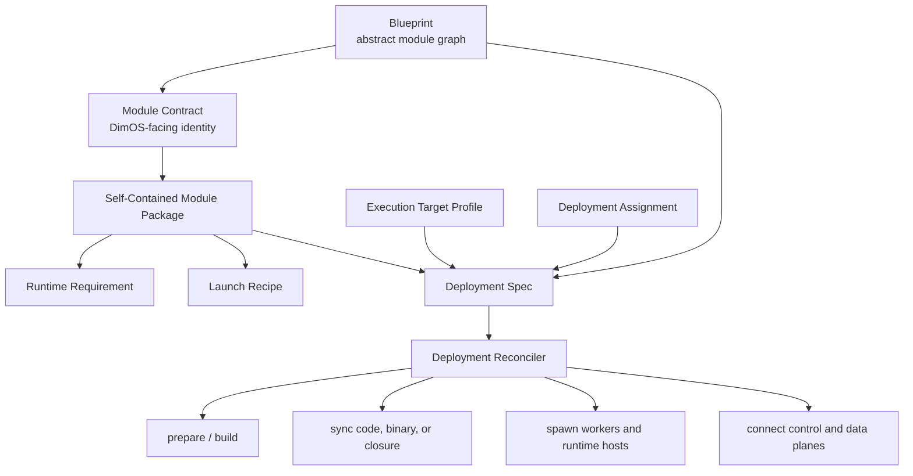
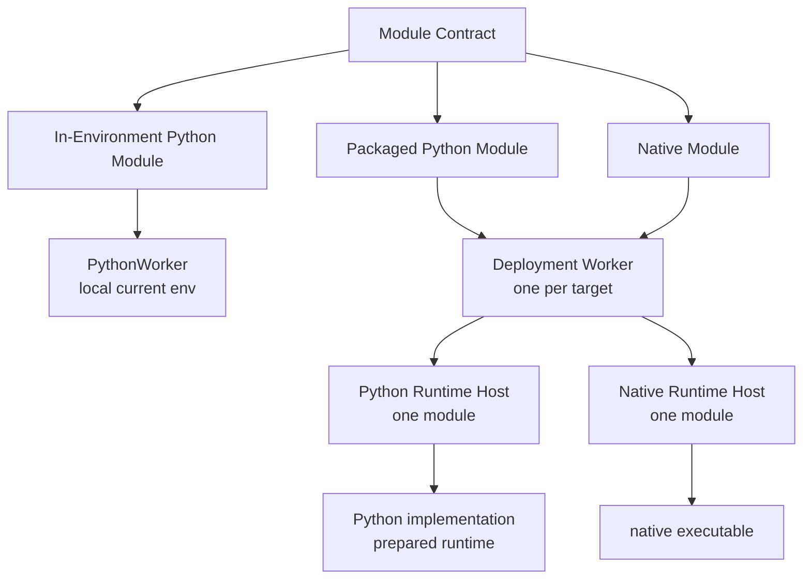

# Proposal: Module Deployment for DimOS

Status: draft for review.

This proposal reframes PR #2704 as one step toward a shared deployment model for Python modules, packaged Python modules, native modules, and remote execution. The key idea is simple: DimOS should keep a stable module identity while deployment decides where and how the implementation runs.

## 1. Problem / Why now

DimOS has several deployment pressures that currently look separate:

- Python modules sometimes need heavy or conflicting dependencies that should not live in the coordinator environment.
- Native modules need repeatable build and runtime preparation.
- Remote deployment needs code or artifact sync, target preparation, process launch, logs, health, and cleanup.
- Weak robot computers may need prepared artifacts, cross-compilation, or runtime closures built elsewhere.
- Native and packaged Python modules need a shared way to describe config, stream topics, transports, and lifecycle handoff.

The common problem is not “Python venvs.” The common problem is **module deployment**.

The current local Python path works well for in-environment Python modules. But once a module has its own runtime requirement, DimOS needs an explicit deployment layer that can prepare the requirement, launch the implementation, and keep the Blueprint-facing module identity stable.

## 2. Current state

### Normal Python modules

Normal Python modules run inside the current DimOS Python worker environment.

```text
ModuleCoordinator
  -> WorkerManagerPython
    -> PythonWorker
      -> Python Module instance
```

They get the full DimOS surface: streams, RPCs, skills, module refs, lifecycle, and Blueprint wiring. This path should remain the default for local, in-environment Python modules.

### Current NativeModule

Today, a native module is a Python `NativeModule` wrapper deployed through the Python worker. The wrapper declares the DimOS-facing streams and config, then spawns an external executable.

```text
PythonWorker
  -> NativeModule wrapper
    -> native subprocess
```

The wrapper owns Blueprint integration, lifecycle, topic assignment, config serialization, logs, and process supervision. The native subprocess owns computation and direct pub/sub.

`NativeModuleConfig` already carries a proto launch recipe:

- `cwd`
- `executable`
- `build_command`
- `extra_args`
- `extra_env`
- `stdin_config`
- `auto_build`

When `stdin_config=True`, the wrapper sends a JSON payload to the native process:

```json
{
  "topics": {"input": "/topic#Type", "output": "/topic#Type"},
  "config": {"field": "value"}
}
```

That JSON is a useful starting point for a future **Module Launch Envelope**.

### PR #2704 proof point

PR #2704 proves one backend: a Python module can keep a dependency-light Module Contract while the implementation runs in a prepared Python runtime project.

It adds:

- runtime environment registration,
- class-keyed runtime placement,
- deployment-time runtime reconciliation,
- runtime-specific Python worker pools,
- launch through the prepared `.venv/bin/python`,
- a runnable example package.

The broader lesson is not the exact worker implementation. The lesson is the seam: **what DimOS sees** can be separated from **where the implementation runs**.

### Native branches point in the same direction

Recent native-module branches show the same pressure from the native side:

- Andrew's stdin-config work makes native config and topics serializable instead of CLI-only.
- Andrew's Rust transport work adds native transport backends, including Zenoh.
- Andrew's Rust TF work gives native modules more of the DimOS service surface.
- Lesh's MLS planner work uses a Python native wrapper beside a Rust package and `cargo build --release`.

These are not the same feature as PR #2704. They point at the same architecture: describe what a module is, what it needs, where it runs, and how deployment prepares it.

## 3. Proposed model



### Blueprint

A Blueprint stays the abstract module graph:

- which Module Contracts participate,
- how streams connect,
- how module refs connect,
- what config surfaces exist.

A plain Blueprint remains locally runnable. `dimos run <blueprint>` should keep today's local-default behavior.

### Module Contract

A Module Contract is the stable DimOS-facing identity. It declares the streams, RPCs, config shape, and lifecycle surface other modules depend on.

The implementation may run:

- in the local Python worker environment,
- in a packaged Python runtime process,
- as a native executable,
- eventually on another machine.

### Self-Contained Module Package

A Self-Contained Module Package is the module-owned deployment unit. It carries:

- Module Contract or NativeModule wrapper,
- implementation source or binary target,
- Runtime Requirement,
- preparation recipe,
- launch recipe,
- optional smoke test.

This should start as a layout convention, not a required manifest.

### Runtime Requirement

Runtime Requirement is the stable environment or artifact declaration needed by the module implementation. Examples:

- Python project with `pyproject.toml` and `uv.lock`,
- Pixi or Nix environment,
- Rust project with `Cargo.toml`,
- C++ project with `CMakeLists.txt`,
- prebuilt executable path.

It does not say which machine runs the module.

### Deployment Spec

A Deployment Spec is deployment-owned. It binds Module Contracts to Execution Target Profiles and describes prepare/sync/run policy.

It does not define the abstract module graph. It references a Blueprint and assigns some or all modules to targets.

## 4. Package discovery convention

Package discovery should be **assignment-first**:

```python
deployment(
    blueprint=go2_stack,
    targets={"robot": ssh_target("go2")},
    assignments={
        MLSPlannerNative: "robot",
        HeavyDetector: "robot",
    },
)
```

The Deployment Spec assigns Module Contracts to targets. DimOS discovers each module package from the Module Contract or NativeModule wrapper anchor.

Explicit package references are overrides for ambiguity or multiple implementations, not required ceremony.

### Existing native precedent

Current native modules already follow a lightweight convention:

```text
mls_planner/
  mls_planner_native.py        # NativeModule wrapper / Module Contract
  rust/
    Cargo.toml
    Cargo.lock
    src/...
```

The wrapper declares:

```python
class MLSPlannerNativeConfig(NativeModuleConfig):
    cwd = "rust"
    executable = "target/release/mls_planner"
    build_command = "cargo build --release"
    stdin_config = True
```

Deployment should generalize this convention rather than replace it with a manifest immediately.

### Packaged Python mirror

Packaged Python should mirror the native shape:

```text
detector/
  detector_module.py           # Module Contract / wrapper
  runtime/
    pyproject.toml
    uv.lock
    src/detector_runtime/
      module.py                # Runtime implementation
```

V1 discovery rule:

1. Start at the Module Contract or NativeModule wrapper file.
2. Walk to the nearest package root.
3. Look for sibling runtime roots such as `runtime/`, `rust/`, `cpp/`, `native/`, `pixi.toml`, or `flake.nix`.
4. If discovery finds multiple candidates, require an explicit package override.

Open question: exactly which directory names should be supported first?

## 5. Worker / runtime architecture

Worker routing should depend on module kind, not on a top-level deployment mode.



### Normal Python modules

Normal Python modules stay local and use the existing PythonWorker path.

```text
Normal Python Module -> PythonWorker
```

They are not remotely deployable in v1. If a module is assigned to a non-local target, it must be packaged Python or native.

### Packaged Python modules

Packaged Python modules always use Deployment Worker plus Runtime Host, even on the local machine.

```text
Packaged Python Module -> DeploymentWorker -> Python RuntimeHost
```

The Deployment Worker spawns and supervises the runtime host without importing user implementation code. The packaged Python entrypoint imports the implementation inside the prepared runtime.

### Native modules

Native modules also converge on Deployment Worker plus Runtime Host for both local and remote assignments.

```text
Native Module -> DeploymentWorker -> Native RuntimeHost
```

This replaces the current permanent model of hosting NativeModule wrappers inside PythonWorker. Migration can be incremental, but the target architecture should use one path.

### Deployment Worker and Runtime Host

V1 uses one Deployment Worker per target and one Runtime Host per packaged/native module.

```text
Execution Target
  DeploymentWorker
    RuntimeHost: module A
    RuntimeHost: module B
    RuntimeHost: module C
```

Deployment Worker is ephemeral per run. A future persistent target agent can implement the same control contract later.

## 6. Control plane vs data plane

Deployment needs two different communication paths.

### Deployment Control Plane

Control plane handles:

- spawn,
- stop,
- lifecycle,
- health,
- logs,
- status,
- method calls where supported.

For packaged/native modules, control flows through:

```text
Coordinator <-> DeploymentWorker <-> RuntimeHost
```

Remote v1 can start the Deployment Worker over SSH and use an SSH-tunneled control connection. A persistent target agent is explicitly later work.

### Deployment Data Plane

Data plane handles module streams:

- images,
- point clouds,
- poses,
- paths,
- commands,
- maps.

Those streams continue to use transports such as Zenoh, DDS, ROS, LCM, or SHM where applicable.

V1 should report cross-target transport assumptions in `dimos deploy plan`, but it should not try to fully prove data-plane compatibility yet. Strict data-plane validation can come later.

### Module Launch Envelope

The Module Launch Envelope is the shared handoff from DimOS to a Runtime Host. It should generalize the current `NativeModule.stdin_config` JSON.

It should carry:

- module identity,
- implementation identity,
- resolved config,
- input and output stream topics,
- transport descriptors,
- optional control-plane details.

PR 1 should normalize the current native stdin JSON as envelope v0 rather than introduce a large schema immediately.

## 7. End-user UX

The safe deployment flow should be explicit:

```bash
dimos deploy plan <deployment>
dimos deploy prepare <deployment>
dimos run <deployment>
```

### `dimos deploy plan`

Dry-run. No remote mutation.

It should show the resolved plan:

```text
Module              Kind              Target   Worker path
Agent               Python            local    PythonWorker
MLSPlannerNative    native            robot    DeploymentWorker -> RuntimeHost
HeavyDetector       packaged-python   gpu      DeploymentWorker -> RuntimeHost
```

It should also show:

- prepare actions,
- sync actions,
- runtime paths,
- transport assumptions,
- obvious missing files or invalid config.

### `dimos deploy prepare`

Mutates targets but does not launch the stack.

It may:

- create target workspaces,
- sync source,
- sync artifacts,
- install locked Python environments,
- run Pixi or Nix setup,
- build native artifacts,
- cross-compile elsewhere and copy outputs.

Prepare should be idempotent: run the package manager, build tool, or sync tool each time and rely on its cache or up-to-date checks.

### `dimos run`

`dimos run <blueprint>` keeps today's local-default behavior.

`dimos run <deployment>` launches a prepared deployment and registers it with the same DimOS run lifecycle commands.

Open question: should `dimos deploy <deployment>` become shorthand for prepare plus run later?

## 8. Lifecycle semantics

Deployment runs should participate in the existing lifecycle model.

- `dimos status` shows coordinator, targets, Deployment Workers, and Runtime Hosts.
- `dimos stop` stops the whole deployment, not just the local coordinator process.
- `dimos restart` reruns the original command; it should not implicitly prepare unless the original command did.
- `dimos log` aggregates coordinator, Deployment Worker, Runtime Host, packaged Python, and native process logs.

Startup should be fail-fast:

```text
if any module fails before deployment is ready:
  stop already-started workers and runtime hosts
  mark deployment failed
```

Runtime Host death after startup should mark the deployment unhealthy. V1 should not auto-restart by default; robot safety makes restart policy an explicit later feature.

Deployment Workers need a coordinator lease. If the coordinator disappears, Deployment Workers should stop their Runtime Hosts instead of leaving orphaned robot processes.

## 9. Implementation path / PR slicing

This should be built in slices.

### Slice 1: normalize native launch envelope

Treat current `NativeModule.stdin_config` JSON as Module Launch Envelope v0.

Goal: make the external process handoff explicit without changing the whole native stack.

### Slice 2: add local Deployment Worker path

Add a target-local Deployment Worker that can spawn Runtime Hosts locally.

No remote yet.

Goal: prove Deployment Worker plus Runtime Host lifecycle, logs, health, and cleanup on one machine.

### Slice 3: move NativeModule onto Runtime Host

Move native module execution from PythonWorker-hosted wrapper to Deployment Worker plus Native Runtime Host.

Goal: native local and native remote eventually share one path.

### Slice 4: add explicit prepare phase

Move native builds and runtime preparation out of `module.start()` / run time.

Goal: `dimos deploy prepare` owns build/env/sync work.

### Slice 5: add packaged Python Runtime Host

Run packaged Python modules through prepared runtime projects and a DimOS Python entrypoint.

Goal: preserve Python module semantics where practical without putting heavy dependencies into Deployment Worker or coordinator.

### Slice 6: add remote target support

Use SSH and rsync for v1:

- start ephemeral Deployment Worker on target,
- sync source/artifacts,
- tunnel control connection,
- run Runtime Hosts on target.

Keep the shape compatible with a future persistent target agent.

### Slice 7: add deployment UX

Add:

- target profiles,
- deployment assignments,
- `dimos deploy plan`,
- `dimos deploy prepare`,
- `dimos run <deployment>`.

## 10. Open questions

1. Exact package convention: which sibling runtime roots should v1 support?
2. When should DimOS add optional `dimos.module.toml` or another manifest?
3. When should deployment definitions get YAML/TOML after Python-first API?
4. How should shared target profiles and local overlays layer secrets and personal machine details?
5. Should `dimos deploy <deployment>` ever become shorthand for prepare plus run?
6. When should strict data-plane compatibility checks become mandatory?
7. What is the minimal resolved-plan JSON schema for tooling and CI?

## Suggested narrative

Use PR #2704 as the proof point, not the whole story:

> PR #2704 adds local Python runtime projects. More importantly, it introduces a seam between what DimOS sees and where a module implementation runs. This proposal extends that seam into a shared deployment model for native modules, packaged Python modules, and remote execution.
