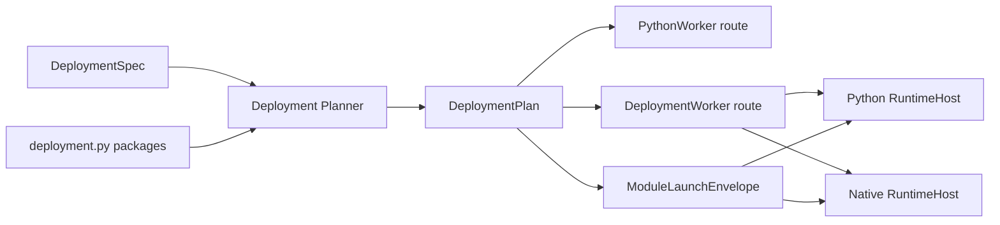
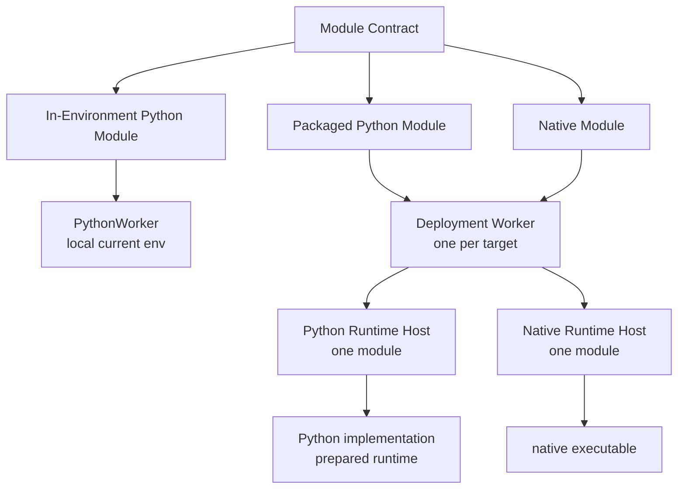

# Proposal: Module Deployment for DimOS

Status: draft for review.

This proposal defines a shared deployment model for normal Python modules, packaged Python modules, native modules, and remote execution. The key idea is simple: DimOS should keep a stable module identity while deployment decides where and how the implementation runs.

## 1. Problem / Why now

DimOS has several deployment pressures that currently look separate:

- Python modules sometimes need heavy or conflicting dependencies that should not live in the coordinator environment.
- Native modules need repeatable build and runtime preparation.
- Remote deployment needs code or artifact sync, target preparation, process launch, logs, health, and cleanup.
- Weak robot computers may need prepared artifacts, cross-compilation, or runtime closures built elsewhere.
- Native and packaged Python modules need a shared way to describe config, stream topics, transports, and lifecycle handoff.

The common problem is **module deployment**.

The current local Python path works well for in-environment Python modules. But once a module has its own runtime requirement, DimOS needs an explicit deployment layer that can prepare the requirement, launch the implementation, and keep the Blueprint-facing module identity stable.

## 2. Current state

### Normal Python modules

Normal Python modules run inside the current DimOS Python worker environment.

```text
ModuleCoordinator
  -> WorkerManagerPython
    -> PythonWorker
      -> Python Module instance
```

They get the full DimOS surface: streams, RPCs, skills, module refs, lifecycle, and Blueprint wiring. This path should remain the default for local, in-environment Python modules.

### Current NativeModule

Today, a native module is a Python `NativeModule` wrapper deployed through the Python worker. The wrapper declares the DimOS-facing streams and config, then spawns an external executable.

```text
PythonWorker
  -> NativeModule wrapper
    -> native subprocess
```

The wrapper owns Blueprint integration, lifecycle, topic assignment, config serialization, logs, and process supervision. The native subprocess owns computation and direct pub/sub.

`NativeModuleConfig` already carries a proto launch recipe:

- `cwd`
- `executable`
- `build_command`
- `extra_args`
- `extra_env`
- `stdin_config`
- `auto_build`

When `stdin_config=True`, the wrapper sends a JSON payload to the native process:

```json
{
  "topics": {"input": "/topic#Type", "output": "/topic#Type"},
  "config": {"field": "value"}
}
```

That JSON is a useful starting point for a future **Module Launch Envelope**.

### Recent packaged Python exploration

Recent work on isolated Python runtime modules, including PR #2704, proves one backend: a Python module can keep a dependency-light Module Contract while the implementation runs in a prepared Python runtime project.

It adds:

- runtime environment registration,
- class-keyed runtime placement,
- deployment-time runtime reconciliation,
- runtime-specific Python worker pools,
- launch through the prepared `.venv/bin/python`,
- a runnable example package.

The broader lesson is not the exact worker implementation. The lesson is the seam: **what DimOS sees** can be separated from **where the implementation runs**.

### Native branches point in the same direction

Recent native-module branches show the same pressure from the native side:

- Andrew's stdin-config work makes native config and topics serializable instead of CLI-only.
- Andrew's Rust transport work adds native transport backends, including Zenoh.
- Andrew's Rust TF work gives native modules more of the DimOS service surface.
- Ivan's MLS planner work uses a Python native wrapper beside a Rust package and `cargo build --release`.

These are not the same feature as packaged Python runtime work. They point at the same architecture: describe what a module is, what it needs, where it runs, and how deployment prepares it.

## 3. Proposed model

The model separates three inputs and one resolved output:

```text
Blueprint              what modules exist and how they connect
deployment.py          how a packaged/native module is prepared and launched
DeploymentSpec         where modules run
DeploymentPlan         validated, concrete prepare and launch actions
```

### 3.1 Complete Deployment Spec

A Deployment Spec references a Blueprint, defines named targets, and assigns Module Contract classes to target names:

```python
go2_deployment = DeploymentSpec(
    blueprint=go2_stack,
    targets={
        "robot": SshTarget(
            host="go2",
            workspace="~/dimos-deployments/go2",
        ),
        "gpu": SshTarget(
            host="gpu-box",
            workspace="~/dimos-deployments/go2",
        ),
    },
    assignments={
        MLSPlannerNative: "robot",
        HeavyDetector: "gpu",
    },
)
```

The v1 rules are concrete:

- `blueprint` supplies active modules, stream wiring, module refs, and config surfaces.
- `targets` maps stable string names to execution target definitions.
- `assignments` maps Module Contract classes to target names.
- `local` always exists as an implicit target.
- modules absent from `assignments` run on `local`.
- an in-environment Python module cannot be assigned to a non-local target.
- package roots, build commands, executables, and implementation paths do not belong in `DeploymentSpec`.

### 3.2 Module-owned package declarations

Packaged and native modules declare their intrinsic prepare and launch information beside the Module Contract. These names illustrate the model; PR 1 will settle the exact internal API.

```text
heavy_detector/
  heavy_detector.py
  deployment.py
  runtime/
    pyproject.toml
    uv.lock
    src/heavy_detector_runtime/
```

```python
# heavy_detector/deployment.py

package = PackagedPythonModule(
    contract=HeavyDetector,
    preset=UvRuntime(
        project="runtime",
        implementation="heavy_detector_runtime.module:HeavyDetectorImpl",
    ),
)
```

```text
mls_planner/
  mls_planner_native.py
  deployment.py
  rust/
    Cargo.toml
    Cargo.lock
    src/...
```

```python
# mls_planner/deployment.py

package = NativeModulePackage(
    contract=MLSPlannerNative,
    preset=CargoNative(
        project="rust",
        executable="target/release/mls_planner",
    ),
)
```

The package declaration owns the runtime root, implementation or executable, Convention Preset, and intrinsic prepare/launch behavior. Deployment Spec owns target assignment and deployment-time strategy; it cannot replace those package facts.

### 3.3 Key model shapes

The internal model should stay data-shaped even if the first implementation uses different names:

```python
@dataclass(frozen=True)
class DeploymentSpec:
    blueprint: Blueprint
    targets: Mapping[str, ExecutionTarget]
    assignments: Mapping[type[ModuleBase], str]
```

```python
@dataclass(frozen=True)
class ModulePackage:
    contract: type[ModuleBase]
    preset: ConventionPreset
```

```python
@dataclass(frozen=True)
class DeploymentPlan:
    modules: tuple[ResolvedModuleDeployment, ...]
```

```python
@dataclass(frozen=True)
class ResolvedModuleDeployment:
    contract: type[ModuleBase]
    target_name: str
    package: ModulePackage | None
    prepare_steps: tuple[PrepareStep, ...]
    worker_route: WorkerRoute
```

The distinction is operational:

```text
DeploymentSpec   user-authored placement intent
ModulePackage    module-owned prepare and launch facts
DeploymentPlan   validated and fully resolved actions
```

### 3.4 Resolution and validation

Deployment planning resolves every active Blueprint module:

```text
for each active module in the Blueprint:
    target = assignments.get(module, "local")

    if module is an in-environment Python module:
        require target == "local"
        route = PythonWorker
    else:
        package = discover deployment.py from the module anchor
        preset = resolve exactly one Convention Preset
        prepare_steps = preset.prepare(package, target)
        route = DeploymentWorker -> RuntimeHost

    emit ResolvedModuleDeployment
```

Planning fails before mutation when:

- an assignment references a target absent from `targets`,
- an assignment references a module absent from the Blueprint,
- an in-environment Python module is assigned remotely,
- a packaged/native module has no discoverable package declaration,
- zero or multiple Convention Presets match,
- a required lockfile, project file, executable, or build declaration is missing.

### 3.5 Resolved plan

The previous Deployment Spec should resolve to an inspectable plan:

```text
Module              Target   Package preset   Prepare                   Worker route
Agent               local    —                —                         PythonWorker
MLSPlannerNative    robot    CargoNative      remote cargo build        DeploymentWorker -> RuntimeHost
HeavyDetector       gpu      UvRuntime         remote uv sync --locked   DeploymentWorker -> RuntimeHost
```

Plan, prepare, and run should consume the same `DeploymentPlan`; they should not independently rediscover package or assignment state.

### 3.6 Module Launch Envelope

After prepare and connection resolution, Runtime Host receives one unified envelope:

```python
@dataclass(frozen=True)
class ModuleLaunchEnvelope:
    module: str
    runtime: RuntimeLaunch
    config: ModuleConfigPayload
    topics: Mapping[str, TopicBinding]
    control: ControlEndpoint
```

```json
{
  "module": "MLSPlannerNative",
  "runtime": {
    "executable": "target/release/mls_planner"
  },
  "topics": {
    "global_map": {
      "channel": "/global_map",
      "type": "sensor_msgs.PointCloud2",
      "transport": "zenoh"
    }
  },
  "config": {
    "world_frame": "map",
    "voxel_size": 0.1
  },
  "control": {
    "endpoint": "..."
  }
}
```

This extends the current `NativeModule.stdin_config` shape. DimOS may track where fields originate internally, but Runtime Host receives one handoff containing launch metadata, module config, stream bindings, transport descriptors, and control details.

### 3.7 Process topology



## 4. Package discovery convention

Package discovery should be **assignment-first**:

```python
deployment(
    blueprint=go2_stack,
    targets={"robot": ssh_target("go2")},
    assignments={
        MLSPlannerNative: "robot",
        HeavyDetector: "robot",
    },
)
```

The Deployment Spec assigns Module Contracts to targets. DimOS discovers each module package from the Module Contract or NativeModule wrapper anchor.

Package settings are module-internal. Deployment Spec should not override package root, executable, implementation path, or build command. If convention discovery is ambiguous, the module should provide package-level configuration in a `deployment.py` sidecar.

### Existing native precedent

Current native modules already follow a lightweight convention:

```text
mls_planner/
  mls_planner_native.py        # NativeModule wrapper / Module Contract
  rust/
    Cargo.toml
    Cargo.lock
    src/...
```

The wrapper declares:

```python
class MLSPlannerNativeConfig(NativeModuleConfig):
    cwd = "rust"
    executable = "target/release/mls_planner"
    build_command = "cargo build --release"
    stdin_config = True
```

Deployment should generalize this convention rather than replace it with a manifest immediately.

For modules that use the new deployment API, add a sidecar file instead of changing the existing wrapper just to prove deployment behavior:

```text
mls_planner/
  mls_planner_native.py        # existing NativeModule wrapper
  deployment.py                # new package/deployment API
  rust/
    Cargo.toml
    src/...
```

### Packaged Python mirror

Packaged Python should mirror the native shape:

```text
detector/
  detector_module.py           # Module Contract / wrapper
  deployment.py                # new package/deployment API
  runtime/
    pyproject.toml
    uv.lock
    src/detector_runtime/
      module.py                # Runtime implementation
```

V1 discovery rule:

1. Start at the Module Contract or NativeModule wrapper file.
2. Walk to the nearest package root.
3. Look for sibling runtime roots such as `runtime/`, `rust/`, `cpp/`, `native/`, `pixi.toml`, or `flake.nix`.
4. If discovery finds multiple candidates, require package-level configuration in `deployment.py`.

Open question: exactly which directory names should be supported first?

### Convention presets

Users should not need to type raw `uv sync`, `pixi install`, `cargo build`, or CMake commands for every module. DimOS should ship **Convention Presets** that recognize common layouts and expand them into default prepare, sync, and launch behavior.

Examples:

```text
runtime/pyproject.toml + runtime/uv.lock
  -> uv runtime preset

runtime/pixi.toml + runtime/pixi.lock + runtime/pyproject.toml
  -> Pixi-backed Python runtime preset

rust/Cargo.toml
  -> Cargo native preset

cpp/CMakeLists.txt
  -> CMake native preset
```

If exactly one preset matches, use it. If no preset or multiple presets match, fail during planning and ask the module to declare package-level configuration in `deployment.py`.

## 5. Worker / runtime architecture

Worker routing should depend on module kind, not on a top-level deployment mode.



### Normal Python modules

Normal Python modules stay local and use the existing PythonWorker path.

```text
Normal Python Module -> PythonWorker
```

They are not remotely deployable in v1. If a module is assigned to a non-local target, it must be packaged Python or native.

This proposal does not replace PythonWorker. In-environment Python modules should keep using PythonWorker because its lightweight object and RPC envelope works well for normal local modules.

### Packaged Python modules

Packaged Python modules always use Deployment Worker plus Runtime Host, even on the local machine.

```text
Packaged Python Module -> DeploymentWorker -> Python RuntimeHost
```

The Deployment Worker spawns and supervises the runtime host without importing user implementation code. The packaged Python entrypoint imports the implementation inside the prepared runtime.

### Native modules

Native modules also converge on Deployment Worker plus Runtime Host for both local and remote assignments.

```text
Native Module -> DeploymentWorker -> Native RuntimeHost
```

This replaces the current permanent model of hosting NativeModule wrappers inside PythonWorker. Migration can be incremental, but the target architecture should use one path.

### Deployment Worker and Runtime Host

V1 uses one Deployment Worker per target and one Runtime Host per packaged/native module.

```text
Execution Target
  DeploymentWorker
    RuntimeHost: module A
    RuntimeHost: module B
    RuntimeHost: module C
```

Deployment Worker is ephemeral per run. A future persistent target agent can implement the same control contract later.

## 6. Control plane vs data plane

Deployment needs two different communication paths.

### Deployment Control Plane

Control plane handles:

- spawn,
- stop,
- lifecycle,
- health,
- logs,
- status,
- method calls where supported.

For packaged/native modules, control flows through:

```text
Coordinator <-> DeploymentWorker <-> RuntimeHost
```

Remote v1 can start the Deployment Worker over SSH and use an SSH-tunneled control connection. A persistent target agent is explicitly later work.

### Deployment Data Plane

Data plane handles module streams:

- images,
- point clouds,
- poses,
- paths,
- commands,
- maps.

Those streams continue to use transports such as Zenoh, DDS, ROS, LCM, or SHM where applicable.

V1 should report cross-target transport assumptions in `dimos deploy plan`, but it should not try to fully prove data-plane compatibility yet. Strict data-plane validation can come later. Section 3.6 defines the Module Launch Envelope that carries the resolved control and stream bindings into each Runtime Host.

## 7. End-user UX

The safe deployment flow should be explicit:

```bash
dimos deploy plan <deployment>
dimos deploy prepare <deployment>
dimos run <deployment>
```

### `dimos deploy plan`

Dry-run. No remote mutation.

It should show the resolved plan:

```text
Module              Kind              Target   Worker path
Agent               Python            local    PythonWorker
MLSPlannerNative    native            robot    DeploymentWorker -> RuntimeHost
HeavyDetector       packaged-python   gpu      DeploymentWorker -> RuntimeHost
```

It should also show:

- prepare actions,
- sync actions,
- runtime paths,
- transport assumptions,
- obvious missing files or invalid config.

### `dimos deploy prepare`

Mutates targets but does not launch the stack.

It may:

- create target workspaces,
- sync source,
- sync artifacts,
- install locked Python environments,
- run Pixi or Nix setup,
- build native artifacts,
- cross-compile elsewhere and copy outputs.

Prepare should be idempotent: run the package manager, build tool, or sync tool each time and rely on its cache or up-to-date checks.

### `dimos run`

`dimos run <blueprint>` keeps today's local-default behavior.

`dimos run <deployment>` launches a prepared deployment and registers it with the same DimOS run lifecycle commands.

Open question: should `dimos deploy <deployment>` become shorthand for prepare plus run later?

## 8. Lifecycle semantics

Deployment runs should participate in the existing lifecycle model.

- `dimos status` shows coordinator, targets, Deployment Workers, and Runtime Hosts.
- `dimos stop` stops the whole deployment, not just the local coordinator process.
- `dimos restart` reruns the original command; it should not implicitly prepare unless the original command did.
- `dimos log` aggregates coordinator, Deployment Worker, Runtime Host, packaged Python, and native process logs.

Startup should be fail-fast:

```text
if any module fails before deployment is ready:
  stop already-started workers and runtime hosts
  mark deployment failed
```

Runtime Host death after startup should mark the deployment unhealthy. V1 should not auto-restart by default; robot safety makes restart policy an explicit later feature.

Deployment Workers need a coordinator lease. If the coordinator disappears, Deployment Workers should stop their Runtime Hosts instead of leaving orphaned robot processes.

## 9. Implementation path / PR slicing

This should be built as a sequence of small PRs. PR #2704 should stay as a draft/reference for the packaged-runtime exploration; it should not merge as the public packaged-Python architecture because packaged Python and native modules should share the same Deployment Worker plus Runtime Host path.

### PR 1: internal shape and skeletons

Define the internal deployment layer without adding user-facing CLI commands or public APIs.

Include:

- `dimos/core/deployment/` package,
- internal `DeploymentSpec` / target / assignment models,
- `ModuleLaunchEnvelope` model,
- `DeploymentWorker` and `RuntimeHost` skeletons,
- Convention Preset interfaces,
- isolated planner tests with fake modules and fake backends,
- a short in-tree design doc.

Exclude:

- no `dimos deploy ...` CLI,
- no `ModuleCoordinator` behavior changes,
- no packaged Python launch,
- no native migration,
- no remote execution.

### PR 2: local packaged Python on the unified path

Add the first narrow public feature: local packaged Python through a Deployment Spec.

This PR should:

- require a Deployment Spec even for local packaged Python,
- prepare the local Python runtime project,
- launch a local Python Runtime Host through Deployment Worker,
- preserve Python module semantics where practical,
- avoid the runtime-specific PythonWorker pool approach explored in PR #2704.

Open question: what is the first runnable entrypoint before the full deployment CLI/registry exists?

### PR 3: local native automatic prepare/build

Add native automatic build/prepare through the new deployment API without changing existing NativeModule wrapper files.

This PR should:

- use Deployment Spec,
- add `deployment.py` sidecar for a native module package,
- use Convention Presets for a native package such as `rust/Cargo.toml`,
- run prepare/build before launch,
- keep existing NativeModule launch path for now.

Use `MLSPlannerNative` to prove the real wrapper plus `rust/Cargo.toml` convention.

### PR 4: NativeModule runtime migration

Move native launch onto Deployment Worker plus Native Runtime Host.

This PR should:

- migrate a tiny native example first,
- keep legacy NativeModule wrapper path available for unmigrated modules,
- make the new path recommended for migrated modules,
- avoid a flag-day migration across all native modules.

After the path is stable, migrate `MLSPlannerNative` and then other native modules.

### PR 5: SSH remote packaged Python

Add remote execution for packaged Python modules.

This PR should:

- define SSH target profiles,
- sync packaged Python source to the target,
- prepare the Python runtime on the target,
- start an ephemeral Deployment Worker over SSH,
- launch remote Python Runtime Hosts,
- keep the control contract compatible with a future persistent target agent.

### PR 6: SSH remote native modules

Add remote execution for native modules.

This PR should:

- sync native source or prepared artifacts,
- support remote native build or cross-compile-and-sync strategies,
- launch remote Native Runtime Hosts,
- keep packaged-Python remote and native remote separate because their prepare and failure modes differ.

## 10. Open questions

1. Exact package convention: which sibling runtime roots should v1 support?
2. When should DimOS add optional `dimos.module.toml` or another manifest?
3. What is the PR 2 run entrypoint for local packaged-Python Deployment Specs before the full CLI/registry exists?
4. When should deployment definitions get YAML/TOML after Python-first API?
5. How should shared target profiles and local overlays layer secrets and personal machine details?
6. Should `dimos deploy <deployment>` ever become shorthand for prepare plus run?
7. When should strict data-plane compatibility checks become mandatory?
8. What is the minimal resolved-plan JSON schema for tooling and CI?

## Suggested narrative

Use recent packaged-Python work as evidence, not as the whole story:

> Recent isolated-runtime work, including PR #2704, shows a seam between what DimOS sees and where a module implementation runs. This proposal extends that seam into a shared deployment model for native modules, packaged Python modules, and remote execution.
